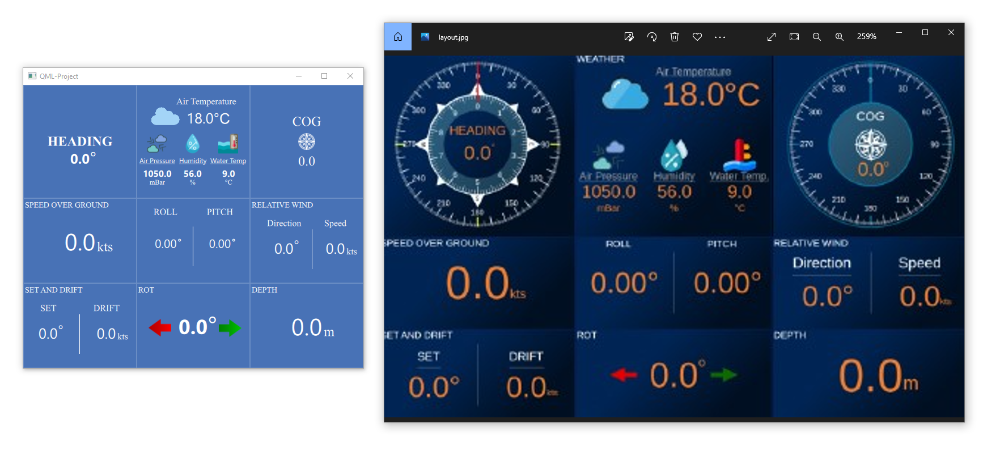

# Project Description

The purpose of the project is to parse NMEA sentences and visualize the output data with QML based UI. We will gather the NMEA messages with TCP/IP Protocols, parse them using [pynmea2](https://github.com/Knio/pynmea2) module and update the UI in real-time.

 

##### NMEA: (National Marine Electronics Association)

 

## Roadmap of Project

- Creating UI layout ✔️
- Finishing the UI design ●
- Developing NMEA parser ●
- Integrating python backend with UI
- Implementing TCP/IP Connection
- Updating UI with parsed messages in real-time.

 

## Currently

We finished the pre-made UI layout that we planned to make. Currently, we are split working on the project. [One of us](https://github.com/Mehmet-Unluturk) is working on QML based UI design and [one of us](https://github.com/Alperencode) is working on algorithm that will parse the NMEA sentences.

 

