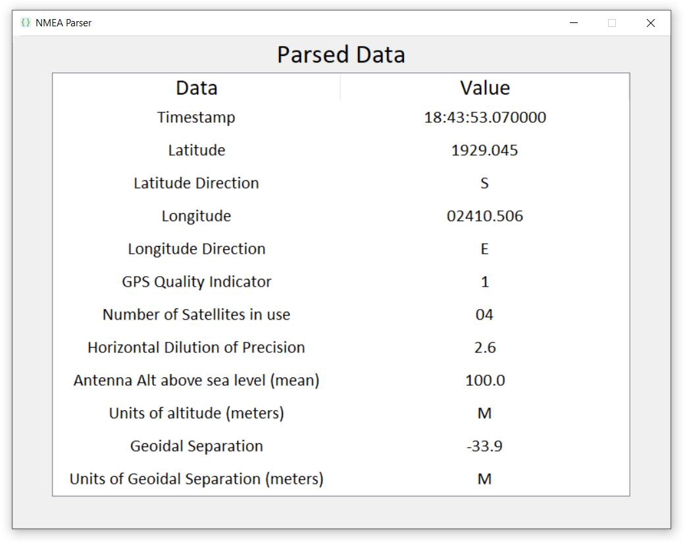
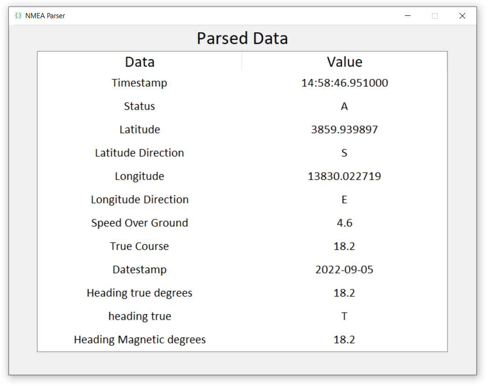

<h1 align=center> NMEA Parser Project </h1>

<p align=center>  </p>

# Project Description
<hr>

The purpose of the project is to parse NMEA sentences and visualize the output data with QML or Tkinter based UI. We will gather the NMEA messages with TCP/IP Protocols, parse them using [NMEA-Parser](https://github.com/Alperencode/NMEA-Parser) that we created using [pynmea2](https://github.com/Knio/pynmea2) module and update the UI in real-time.


##### NMEA: (National Marine Electronics Association)

<br>

## Usage
<hr>

To use the project, you need to download the project from releases section. Then run the executable file.

First you need to select the file that contains the NMEA messages. 
There is sample `log` files in the zip file.

Then program will automatically parse the messages and display them in the main window.

<br>

## Example Parsed NMEA Sentence
<hr>

NMEA sentence:

```
$GPGGA,184353.07,1929.045,S,02410.506,E,1,04,2.6,100.00,M,-33.9,M,,0000*6D
```

Parsed data:



<br>

## Roadmap of the Project
<hr>


- Main
    - Developing NMEA parser ✔️
    - Creating UI (Tkinter) ✔️
    - Integrating parser with UI ✔️
    - Implementing TCP/IP Connection ●
    - Updating UI with parsed messages in real-time.

- Additional
    - Creating QML based UI


<br>

## Screenshots
<hr>

#### Opening MessageBox


<br>

#### File Dialog (File Selection)


<br>

#### Main Window (Parsed Messages)


